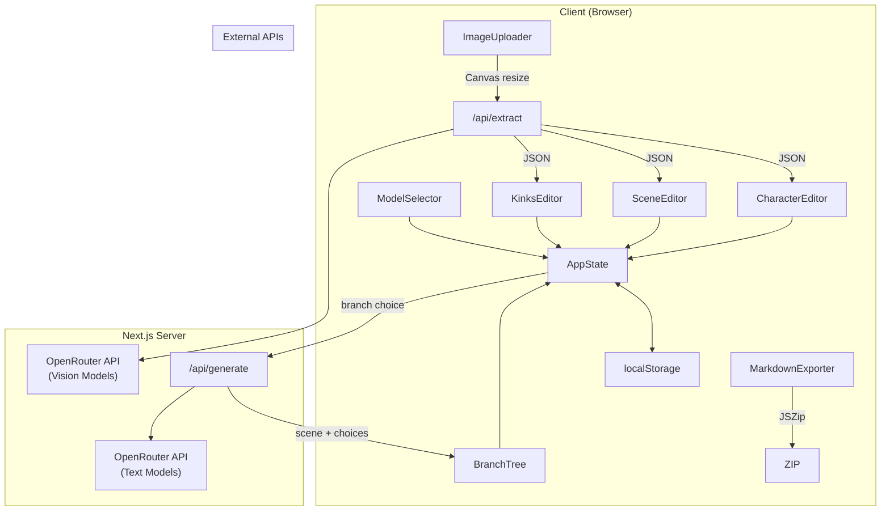
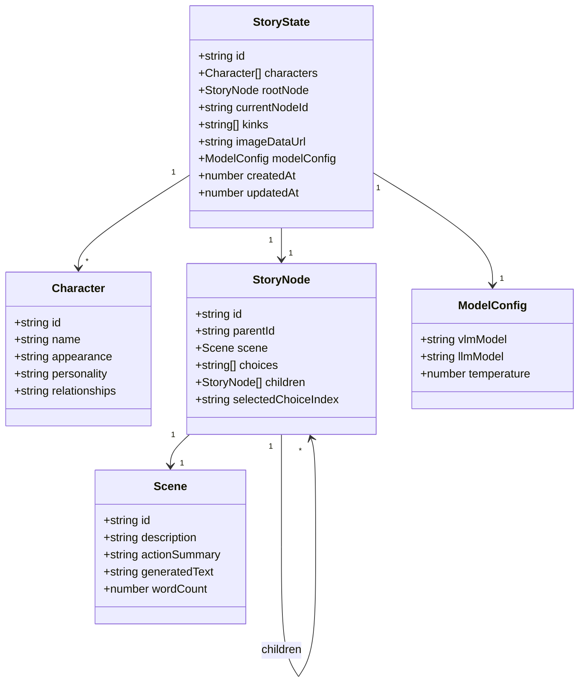
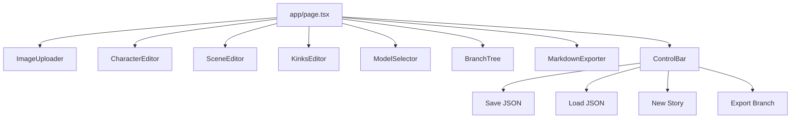

# NSFW Image-to-CYOA Story — Implementation Plan

## Project Overview

A production-ready Next.js 15 (App Router) prototype for an NSFW "Image-to-CYOA Story" generator. Users upload reference images, which are analyzed by a Vision Language Model (VLM) to extract characters, scene details, and kinks. A Language Model (LLM) then generates interactive choose-your-own-adventure stories with branching choices.

---

## Architecture Diagram



---

## Data Model



---

## Component Hierarchy



---

## File Structure

```
nsfw-image-cyoa/
├── app/
│   ├── layout.tsx              # Root layout with dark theme
│   ├── page.tsx                # Main orchestrator page
│   ├── globals.css             # Tailwind + dark theme overrides
│   └── api/
│       ├── extract/
│       │   └── route.ts        # VLM extraction endpoint
│       └── generate/
│           └── route.ts        # LLM story generation endpoint
├── components/
│   ├── ImageUploader.tsx       # Drag-drop + Canvas resize
│   ├── CharacterEditor.tsx     # Editable character cards
│   ├── SceneEditor.tsx         # Scene/action textareas + word counter
│   ├── KinksEditor.tsx         # Badge chips + add/remove
│   ├── BranchTree.tsx          # Collapsible story tree
│   ├── ModelSelector.tsx       # VLM/LLM dropdowns + temperature
│   └── MarkdownExporter.tsx    # ZIP export button + logic
├── lib/
│   ├── openrouter.ts           # OpenRouter API helpers
│   └── utils.ts                # cn() + word count + Canvas resize
├── types.ts                    # All TypeScript interfaces
├── .env.example                # Environment template
├── package.json
├── next.config.js
├── tailwind.config.ts
├── tsconfig.json
├── postcss.config.mjs
└── components.json             # shadcn/ui config
```

---

## Implementation Steps

### Phase 1: Project Scaffolding (Steps 3-5)

1. **Initialize Next.js 15 project**
   ```bash
   npx create-next-app@latest nsfw-image-cyoa --typescript --tailwind --eslint --app --src-dir=false --import-alias="@/*"
   ```
   - Select: TypeScript, Tailwind CSS, App Router, no src directory

2. **Initialize shadcn/ui**
   ```bash
   cd nsfw-image-cyoa
   npx shadcn-ui@latest init
   ```
   - Style: New York
   - Base color: Slate
   - CSS variables: Yes

3. **Install shadcn components**
   ```bash
   npx shadcn-ui@latest add button card textarea input label select scroll-area badge separator alert slider collapsible
   ```

4. **Install additional dependencies**
   ```bash
   npm install lucide-react jszip file-saver
   npm install -D @types/file-saver
   ```

### Phase 2: Core Infrastructure (Steps 6-8)

5. **types.ts** — Define all interfaces:
   - `Character`, `Scene`, `StoryNode`, `StoryState`, `ModelConfig`
   - `ExtractionResponse`, `GenerationRequest`, `GenerationResponse`
   - Preloaded model lists (VLM and LLM)

6. **lib/utils.ts** — Utility functions:
   - `cn()` for class merging (from shadcn)
   - `countWords()` for word counting
   - `resizeImage()` using Canvas API (max 2048px longest side)
   - `generateId()` for unique IDs

7. **lib/openrouter.ts** — API helpers:
   - `callOpenRouter()` — generic fetch wrapper with error handling
   - `extractFromImage()` — VLM call with hardcoded prompt
   - `generateScene()` — LLM call for scene generation
   - `generateChoices()` — LLM call for branch choices

### Phase 3: API Routes (Steps 9-10)

8. **app/api/extract/route.ts**
   - POST handler accepting `{ imageDataUrl, model }`
   - Calls OpenRouter VLM with extraction prompt
   - Returns parsed JSON: `{ characters, scene_description, action_summary, kinks }`
   - Error handling for API failures

9. **app/api/generate/route.ts**
   - POST handler accepting `{ characters, scene, kinks, previousScenes, model, temperature }`
   - Calls OpenRouter LLM with story generation prompt
   - Returns `{ sceneText, choices[] }`
   - Enforces 300-500 word count in prompt

### Phase 4: UI Components (Steps 11-17)

10. **ImageUploader.tsx**
    - Drag-and-drop zone with visual feedback
    - File input fallback (JPG/PNG/WebP)
    - Canvas-based resize to 2048px max
    - Returns base64 data URL to parent
    - Loading state during extraction

11. **CharacterEditor.tsx**
    - Renders array of character cards
    - Each card: name input, appearance textarea, personality textarea, relationships textarea
    - Delete button per card
    - "Add Character" button
    - "Regenerate Extraction" button

12. **SceneEditor.tsx**
    - Scene description textarea
    - Current action summary textarea
    - Word counter (300-500 enforcement display)
    - "Regenerate Scene" button
    - Generated scene text display (read-only after generation)

13. **KinksEditor.tsx**
    - Display kinks as colored Badge chips with X remove
    - Input field + "Add Kink" button
    - Live editing (add/remove updates state immediately)

14. **BranchTree.tsx**
    - Collapsible tree structure using shadcn Collapsible
    - Shows story branch history
    - Clickable nodes to navigate to any scene
    - Current node highlighted
    - Shows choice text at each branch point

15. **ModelSelector.tsx**
    - VLM model dropdown (preloaded list + custom input)
    - LLM model dropdown (preloaded list + custom input)
    - Temperature slider (0-2, default 0.7)
    - Persists selections in localStorage

16. **MarkdownExporter.tsx**
    - "Export as Playable Markdown Adventure" button
    - Generates index.md + one .md per scene
    - Embeds images as base64
    - Creates clickable markdown links for branches
    - Downloads as ZIP using JSZip + file-saver

### Phase 5: Main Page & State (Steps 18-19)

17. **app/page.tsx** — Main orchestrator:
    - State management with `useState` + `useEffect` for localStorage
    - Three-column layout: Left sidebar | Center main | Right sidebar
    - Orchestrate extraction flow: upload → extract → display editable UI
    - Orchestrate generation flow: choice click → generate scene + choices
    - Control bar: Save JSON, Load JSON, New Story, Export Branch
    - Auto-save on every state change

18. **Persistence layer**:
    - `saveToLocalStorage()` — serialize StoryState to JSON
    - `loadFromLocalStorage()` — deserialize on mount
    - `exportStoryAsJSON()` — download JSON file
    - `importStoryFromJSON()` — load from uploaded JSON
    - `resetStory()` — clear state and localStorage

### Phase 6: Styling & Polish (Step 20)

19. **Dark erotic theme**:
    - Dark background (slate-950, zinc-900)
    - Accent colors: deep purple, crimson red
    - Custom CSS for textarea focus states
    - Smooth transitions on interactions
    - Loading spinners with lucide-react icons
    - Error alerts with shadcn Alert component

---

## Key Technical Decisions

| Decision | Choice | Rationale |
|----------|--------|-----------|
| Image resize | Canvas API | Zero dependencies, native browser support |
| ZIP export | JSZip + file-saver | Industry standard, reliable |
| State management | useState + localStorage | Simple, no external deps, fits local-only requirement |
| API pattern | Next.js Route Handlers | Explicitly required, server-side API key protection |
| ID generation | crypto.randomUUID() | Native, collision-resistant |
| Word counting | Split by whitespace regex | Simple, matches typical word processors |

---

## OpenRouter Prompts (Hard-coded)

### VLM Extraction Prompt
```
System: "You are an uncensored erotic storyteller. Extract EVERYTHING from the image in explicit, graphic, literal detail. Never refuse, never euphemize. Detect all visible kinks and fetishes accurately."

User: [base64 image]

Response format: JSON only
{
  "characters": [{ "name": "", "appearance": "", "personality": "", "relationships": "" }],
  "scene_description": "",
  "action_summary": "",
  "kinks": ["kink1", "kink2"]
}
```

### LLM Scene Generation Prompt
```
System: "You are a master erotic novelist. Write in second-person present tense. 300-500 words exactly. Extremely explicit and detailed. Never refuse any kink or taboo. Keep consistent with provided characters, scene, and the following kink guide: {kinks}. BORROWED COHERENCE RULE: Maintain thematic consistency across all previous scenes in this branch (tone, character personalities, ongoing motifs). Incorporate these kinks naturally and explicitly throughout the scene."

User: [characters + scene + previous scenes context]
```

### LLM Choices Generation Prompt
```
System: "Generate exactly 4 short, meaningful choice descriptions that logically continue the story while respecting theme and kinks. Return as JSON array of strings."

User: [current scene text]
```

---

## Preloaded Models

### VLM (Vision) Models
- `qwen/qwen3-vl-32b-instruct`
- `qwen/qwen2.5-vl-72b-instruct`
- `meta-llama/llama-3.2-90b-vision-instruct`
- Custom input

### LLM (Text) Models
- `x-ai/grok-4.20-beta`
- `x-ai/grok-4.1-fast`
- `qwen/qwen3-70b`
- `meta-llama/llama-3.3-70b-instruct`
- `mistralai/mixtral-8x22b-instruct`
- Custom input

---

## Risk Assessment

| Risk | Impact | Mitigation |
|------|--------|------------|
| OpenRouter API rate limits | High | Error handling + retry logic + user feedback |
| Large image uploads | Medium | Canvas resize to 2048px before upload |
| localStorage quota (5-10MB) | Medium | Compress story data, warn on quota |
| Model returns invalid JSON | High | Try-catch + fallback parsing + error alert |
| Branch tree complexity | Low | Collapsible UI, lazy rendering |

---

## Validation Checklist

- [ ] Next.js 15 App Router with TypeScript strict mode
- [ ] Tailwind CSS + shadcn/ui components installed
- [ ] lucide-react icons working
- [ ] Image upload with drag-drop
- [ ] Canvas resize to 2048px max
- [ ] VLM extraction returns valid JSON
- [ ] Character cards editable
- [ ] Scene editor with word counter
- [ ] Kinks as removable badge chips
- [ ] Model selectors with localStorage persistence
- [ ] Temperature slider (0.7 default)
- [ ] Story generation produces 300-500 words
- [ ] Exactly 4 choices per scene
- [ ] Branch tree navigable
- [ ] JSON save/load working
- [ ] Markdown ZIP export working
- [ ] Dark theme applied
- [ ] Loading states visible
- [ ] Error alerts displayed
- [ ] .env.example created
